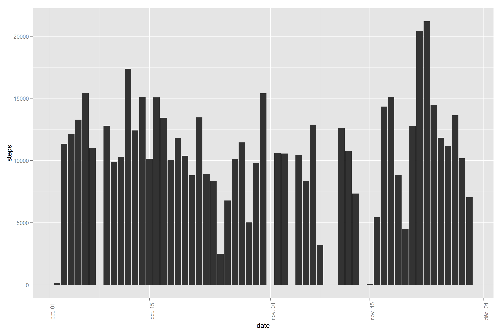
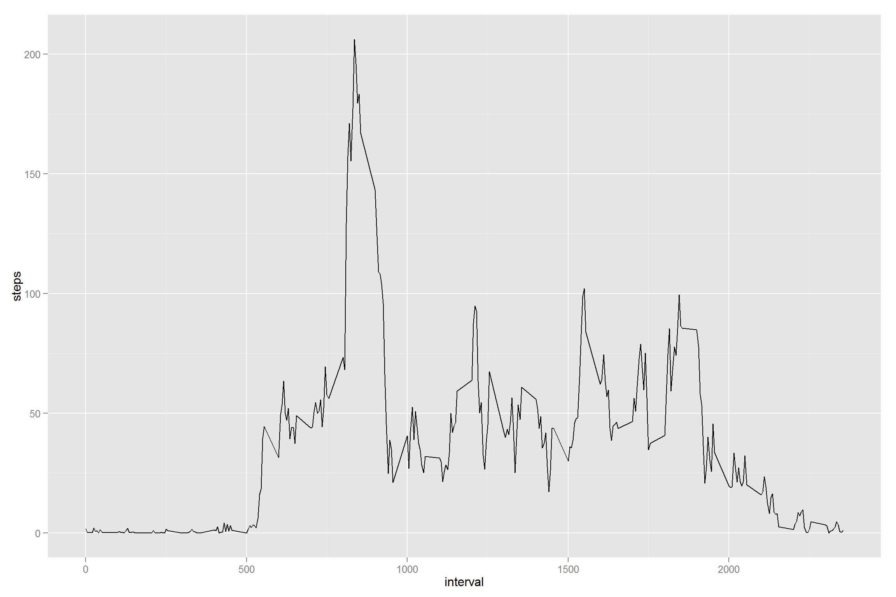
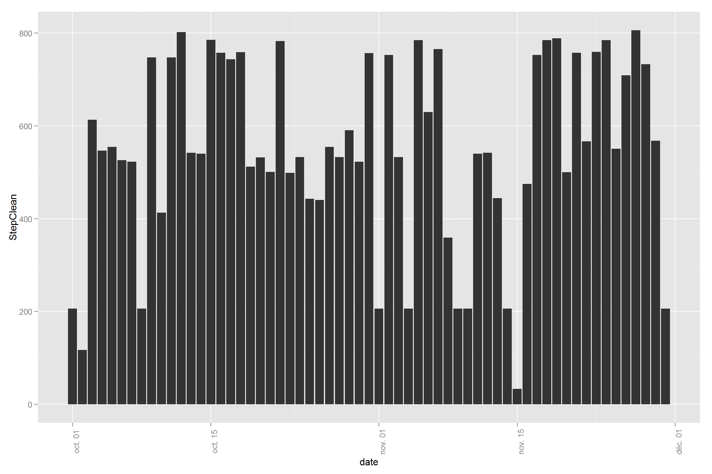
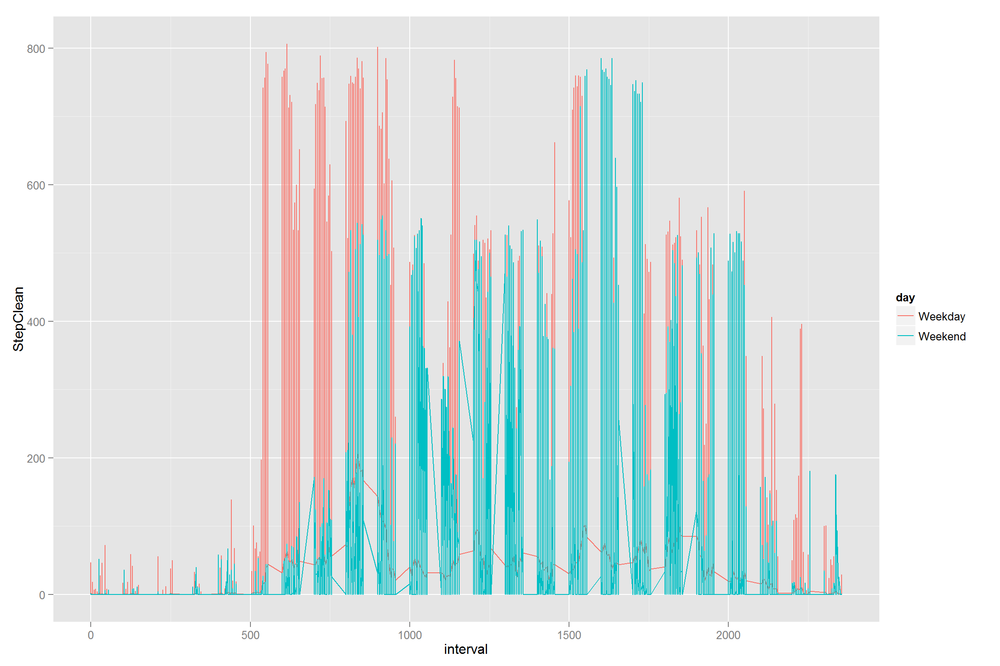

## Loading and preprocessing the data
### Loading data
### 1. Preparing the packages

```{r, echo=FALSE}
require(knitr)
require(RCurl)
require(data.table)
require(lattice)
require(reshape2)
require(ggplot2)
require(Hmisc)
require(plyr)
```


### 2. Downloading the data set

Warning: 

+ https is a problem for R in many cases, so you need to use a package like RCurl to get around it.

+ So the problem is that R does not allow connections to https URL's.You can use download.file with curl

1.Set your work directory
```{r, echo=FALSE}
f1<-setwd("C:/Users/cberthillon/018.Coursera/006.ReproducibleResearch/010.PeerAssessment1")

```

```{r global_options, include=FALSE}
opts_chunk$set(fig.width=12, fig.height=8, fig.path='figure/',
               echo=FALSE, warning=FALSE, message=FALSE)
```

+ Read activity.csv
```{r}
f2 <- read.csv("activity.csv")
```

+ Format columns


```{r}
#Identify the columns
head(f2)

#format interval
f2$interval <- as.numeric(f2$interval)

#format date
f2$date <- as.Date(f2$date, "%Y-%m-%d")

#format interval
f2$steps <- as.numeric(f2$steps)

head(f2)
```

### 3. What is mean total number of steps taken per day?

For this part of the assignment, you can ignore the missing values in the dataset.

1.Make a histogram of the total number of steps taken each day

```{r}
#Aggregate the number of steps per date
f3 <- aggregate(steps ~ date, data = f2, sum, na.rm = TRUE)
f4<- ggplot(data=f3, aes(x=date, y=steps)) + #graph de base
        geom_bar(stat = "identity", position = "dodge") + #type de chart
        scale_fill_brewer(palette="Set1")+ # http://www.cookbook-r.com/Graphs/Colors_(ggplot2)/
        theme(axis.text.x = element_text(angle=90))
f4
```
 

2.Calculate and report the mean and median total number of steps taken per day
```{r}
#Summary triggered for general information purpose
summary(f3)
mean(f3$steps)
median(f3$steps)
```

### 4. What is the average daily activity pattern?

1.Make a time series plot (i.e. type = "l") of the 5-minute interval (x-axis) and the average number of steps taken, averaged across all days (y-axis)

```{r}
#Aggregate the number of steps per date
f5 <- aggregate(f2$steps, by=list(f2$interval), mean, na.rm = TRUE) 
# could be f5<- tapply(f2$steps, f2$interval, mean, na.rm = TRUE)
colnames(f5)[1] <- "interval"
colnames(f5)[2] <- "steps"
f6<- ggplot(data=f5, aes(x=interval, y=steps)) + #graph de base
        geom_line(stat = "identity", position = "dodge") + #type de chart
        scale_fill_brewer(palette="Set1") # http://www.cookbook-r.com/Graphs/Colors_(ggplot2)/
f6
```


2.Which 5-minute interval, on average across all the days in the dataset, contains the maximum number of steps?

```{r}
#Identify the row of the data frame that contains the maximum number of steps
f7<-which.max(f5$steps)  

#details of the row
f5[f7,]
```

### 5.Imputing missing values

1.Calculate and report the total number of missing values in the dataset (i.e. the total number of rows with NAs)

```{r}
#Identify the row of the data frame that contains the maximum number of steps
f8<- sum(is.na(f2)) 
```

2.Devise a strategy for filling in all of the missing values in the dataset. The strategy does not need to be sophisticated. For example, you could use the mean/median for that day, or the mean for that 5-minute interval, etc.

+ To identify the interval which have at least one record with an age missing, I'll use the bystats function from the Hmisc package.


```{r}
#To identify the titles which have at least one record with a step missing, I'll use the bystats function from the Hmisc package.
options(digits=2)
f9<-bystats(f2$steps, f2$interval,fun=function(x)c(Mean=mean(x),Median=median(x)))
```


+ I will also include the mean for each interval, in order to allocate the mean of interval to the missing value of each interval

```{r}
# Then I fill in each of the NA values with the mean with the loops
f10 <- aggregate(steps ~ interval, data = f2, FUN = mean)
f11 <- numeric()
for (i in 1:nrow(f2)) {
    obs <- f2[i, ]
    if (is.na(obs$steps)) {
        steps <- subset(f10, interval == obs$interval)$steps
    } else {
        steps <- obs$steps
    }
    f11 <- c(f11, steps)
}

```

3.Create a new dataset that is equal to the original dataset but with the missing data filled in.

```{r}
f12 <- cbind(f11,f2)
colnames(f12)[1] <- "StepClean"
head(f12)
```

4.Make a histogram of the total number of steps taken each day and Calculate and report the mean and median total number of steps taken per day. Do these values differ from the estimates from the first part of the assignment?
```{r}
f13<- ggplot(data=f12, aes(x=date, y=StepClean)) + #graph de base
        geom_bar(stat = "identity", position = "dodge") + #type de chart
        scale_fill_brewer(palette="Set1")+ # http://www.cookbook-r.com/Graphs/Colors_(ggplot2)/
        theme(axis.text.x = element_text(angle=90))
f13
```
 

5.What is the impact of imputing missing data on the estimates of the total daily number of steps?
```{r}
stepswithNA<-summary(f2$steps)
stepswthoutNA<-summary(f12$StepClean)
f14<-rbind(stepswithNA,stepswthoutNA)
f14
```

### 6. Are there differences in activity patterns between weekdays and weekends?

1.For this part the weekdays() function may be of some help here. Use the dataset with the filled-in missing values for this part.

2.Create a new factor variable in the dataset with two levels - "weekday" and "weekend" indicating whether a given date is a weekday or weekend day.

```{r}
#To allocate the day to the date, I'll use the weekdays() function
f15<- weekdays(as.Date(f12$date))
f16<-cbind(f12,f15)
colnames(f16)[5] <- "day"

#Then I'll separate the week days from the weekend days
f17 <- vector()
for (i in 1:nrow(f16)) {
    if (f15[i] == "samedi") {
        f17[i] <- "Weekend"
    } else if (f15[i] == "dimanche") {
        f17[i] <- "Weekend"
    } else {
        f17[i] <- "Weekday"
    }
}

```

3.Create a new dataset that is equal to the original dataset but with the missing data filled in.

```{r}
f18 <- cbind(f12,f17)
colnames(f18)[5] <- "day"
```
View(f18)

4.Make a panel plot containing a time series plot (i.e. type = "l") of the 5-minute interval (x-axis) and the average number of steps taken, averaged across all weekday days or weekend days (y-axis). 

```{r}
f19 <- subset(f18, subset=(day=="Weekday"))
f20 <- subset(f18, subset=(day=="Weekend"))
View(f19)
View(f20)
f21<-ggplot(f19,aes(interval,StepClean))+geom_line(aes(color="Weekday"))+
  geom_line(data=f20,aes(color="Weekend"))+
  labs(color="day")
f21
```

